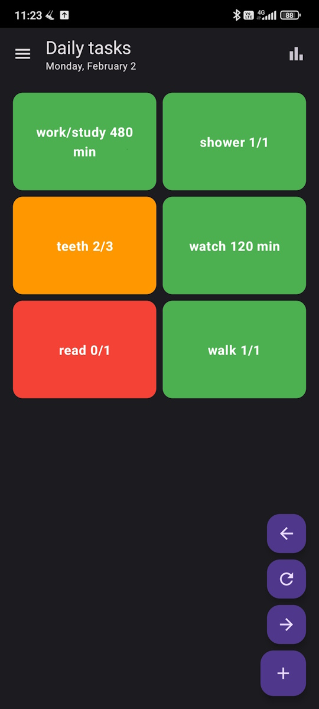
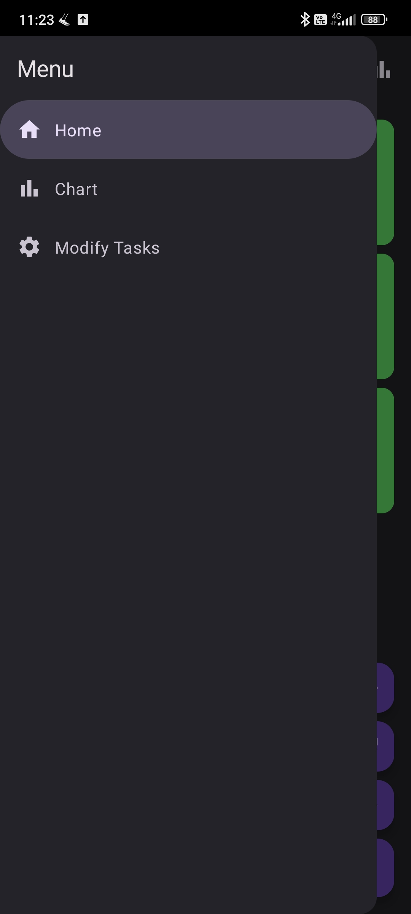
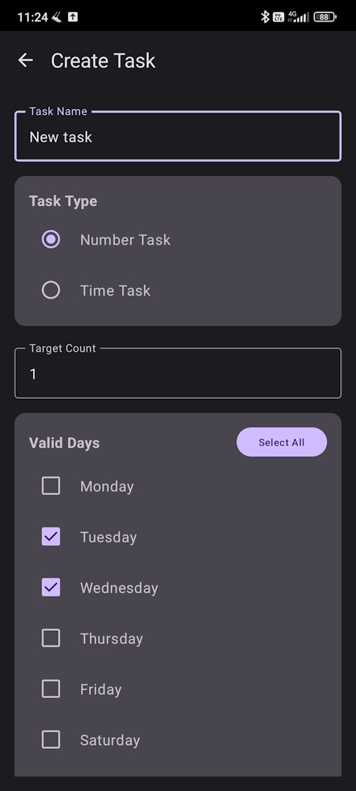
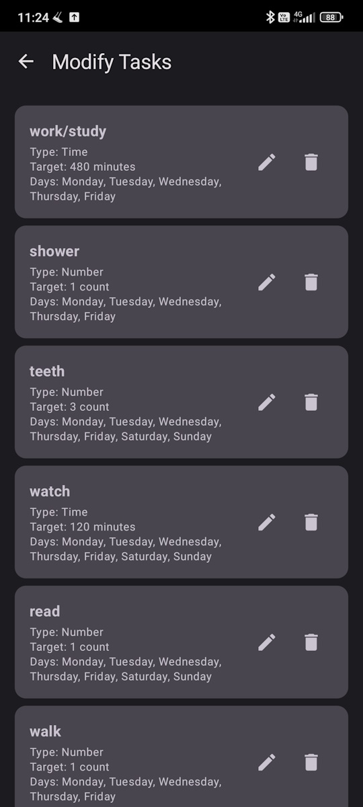
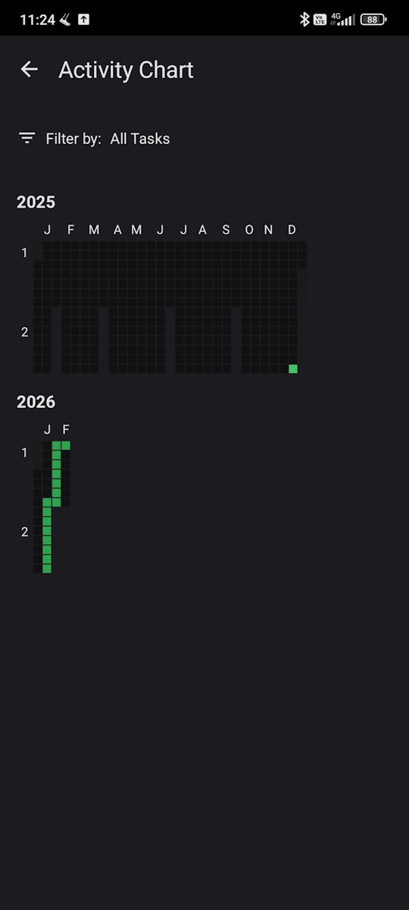

# MyDailyStuffApp

A modern Android task management app built with Jetpack Compose that helps you track your daily tasks and habits. The app features automatic daily backups to Google Drive, ensuring your data is always safe.

## Features

- ✅ **Task Management**: Create, edit, and organize your daily tasks
- 📊 **Progress Tracking**: Track task completions and view statistics
- 📈 **Charts & Analytics**: Visualize your task completion trends over time
- 🔄 **Automatic Backups**: Daily automatic backups to Google Drive
- 🔐 **Google Sign-In**: Secure authentication with Google accounts
- 🎨 **Modern UI**: Built with Material 3 design and Jetpack Compose
- 📱 **Dark Theme**: Beautiful dark theme interface

## Screenshots

### Home Screen


### Menu


### Task Creation


### Task List


### Charts & Analytics


## Tech Stack

- **Language**: Kotlin
- **UI Framework**: Jetpack Compose
- **Architecture**: MVVM (Model-View-ViewModel)
- **Database**: Room Database
- **Backup**: Google Drive API
- **Authentication**: Google Sign-In
- **Dependency Injection**: Manual (ViewModels with Factory pattern)
- **Navigation**: Jetpack Navigation Compose
- **Async Operations**: Kotlin Coroutines

## Requirements

- Android Studio Hedgehog (2023.1.1) or later
- Android SDK 24 (Android 7.0) or higher
- Target SDK: 34
- Java 17

## Setup Instructions

### 1. Clone the Repository

```bash
git clone <repository-url>
cd MyDailyStuffApp
```

### 2. Configure Google Drive Backup

The app uses Google Drive for automatic daily backups. Follow the detailed setup guide in [BACKUP_SETUP.md](BACKUP_SETUP.md) to configure:

- Google Cloud Project
- Service Account (recommended) or OAuth
- Google Drive API
- Service account key file

**Quick Setup Summary:**

1. Create a Google Drive folder for backups
2. Create a service account in Google Cloud Console
3. Enable Google Drive API
4. Download the service account JSON key
5. Place it in `app/src/main/assets/service_account_key.json`
6. Configure the folder ID in the app

For detailed instructions, see [BACKUP_SETUP.md](BACKUP_SETUP.md).

### 3. Build the Project

1. Open the project in Android Studio
2. Sync Gradle files
3. Build the project (Build → Make Project)
4. Run on an emulator or physical device

## Project Structure

```
app/src/main/java/com/dailystuffapp/
├── data/
│   ├── backup/              # Google Drive backup implementation
│   ├── database/            # Room database entities and DAOs
│   └── repository/          # Data repository layer
├── domain/                  # Domain models and enums
├── navigation/              # Navigation setup
└── ui/
    ├── components/          # Reusable UI components
    ├── screens/             # App screens (Main, Create, Chart, Edit)
    └── viewmodel/           # ViewModels for each screen
```

## Key Components

### Screens

- **MainScreen**: Displays daily tasks with completion tracking
- **CreateTaskScreen**: Create new tasks
- **ChartScreen**: View task completion statistics and trends
- **EditTasksScreen**: Edit and manage existing tasks

### Database

- **Task**: Task entity with name, type, and schedule
- **TaskCompletion**: Tracks when tasks were completed
- **AppDatabase**: Room database instance

### Backup System

- **DatabaseBackup**: Handles Google Sign-In and backup orchestration
- **SimpleDriveBackupService**: Implements Google Drive backup operations

## How It Works

1. **Task Creation**: Users create tasks that can be scheduled for specific days
2. **Daily Tracking**: Mark tasks as complete on each day
3. **Statistics**: View completion rates and trends in the chart screen
4. **Automatic Backup**: The app automatically backs up data to Google Drive daily when the app starts (if not already backed up today)

## Permissions

The app requires the following permissions:

- `INTERNET`: For Google Drive API access
- `ACCESS_NETWORK_STATE`: To check network connectivity
- `GET_ACCOUNTS`: For Google Sign-In
- `USE_CREDENTIALS`: For Google authentication

## Dependencies

Key dependencies include:

- Jetpack Compose BOM
- Material 3
- Room Database
- Navigation Compose
- Google Play Services Auth
- Google Drive API
- WorkManager (for scheduled backups)
- Kotlin Coroutines

See `app/build.gradle.kts` for the complete list.

## Building

### Debug Build

```bash
./gradlew assembleDebug
```

### Release Build

```bash
./gradlew assembleRelease
```

## Troubleshooting

### Backup Issues

- Ensure `service_account_key.json` is in `app/src/main/assets/`
- Verify Google Drive API is enabled in your Google Cloud project
- Check that the folder is shared with the service account (or set to "Anyone with link")
- Review Logcat for error messages (filter by "BackupWorker" or "SimpleDriveBackup")

### Build Issues

- Ensure you're using Java 17
- Sync Gradle files after cloning
- Clean and rebuild if you encounter dependency issues

## Contributing

Contributions are welcome! Please feel free to submit a Pull Request.

## License

_Add your license here_

## Author

_Add your name/contact information here_

---

For backup setup details, see [BACKUP_SETUP.md](BACKUP_SETUP.md)
